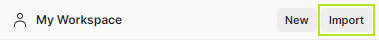
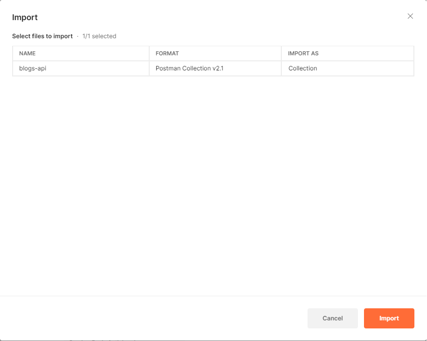
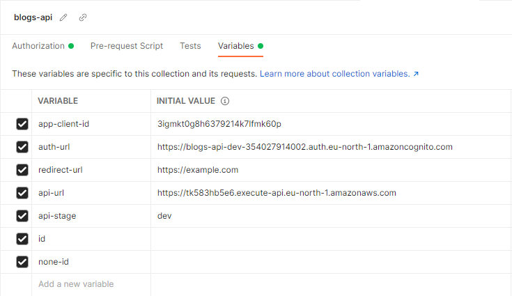
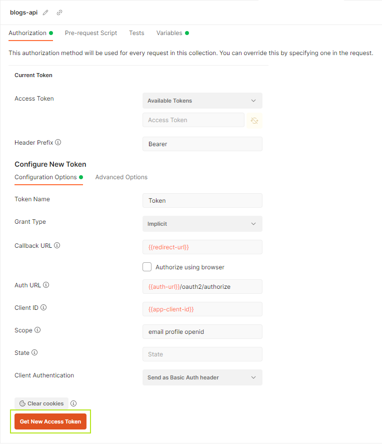
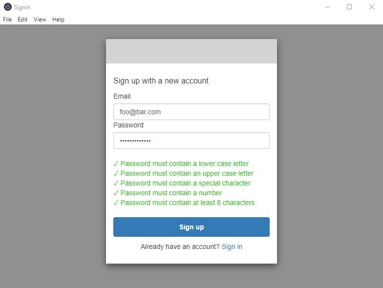
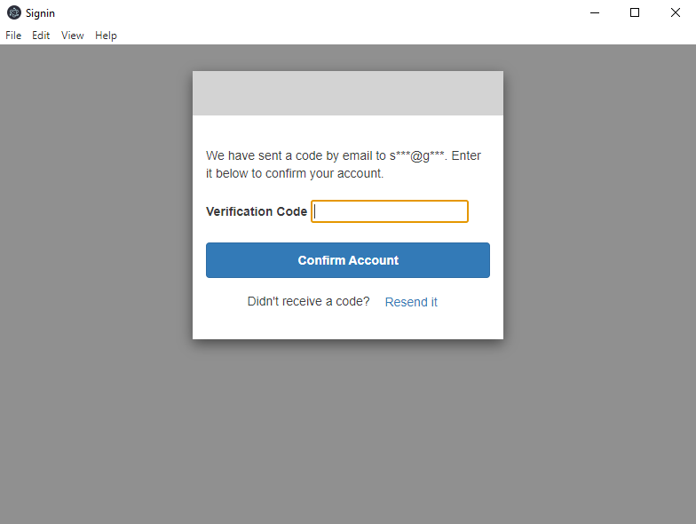
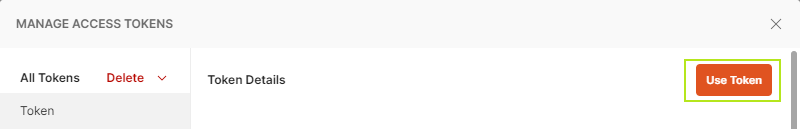
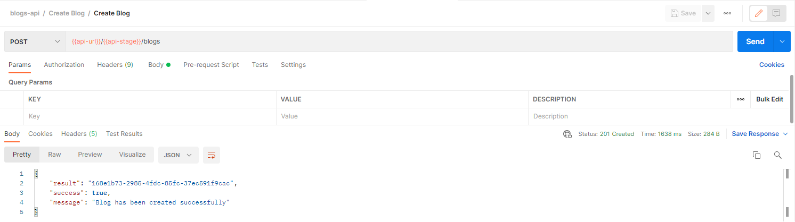

# Blogs API with CloudFormation and SAM

En este proyecto se han utilizado de varias tecnologías de AWS para la creación de una API de blogs. Se ha utilizado SAM y Cloudformation para la definición de la infraestructura que se debe desplegar en AWS, haciendo uso de servicios como Lambda, API Gateway, Cognito y DynamoDB, y coordinando la interacción entre estos.

# Preparación del entorno en local

Para el desarrollo de la API se ha utilizado las siguientes herramientas:

- NodeJS: Runtime utilizado para ejecutar las funciones _handler_ y utilizar sus dependencias.
- AWS CLI: Aplicación de consola de AWS utilizada para establecer las credenciales del usuario IAM, con el que se realiza el despliegue de la aplicación.
- SAM CLI: Aplicación de consola de AWS utilizada para orquestrar el despliegue de la API en AWS y para probarla localmente.
- Docker: Herramienta utilizada para desplegar una BBDD de DynamoDB en local con el objetivo de realizar pruebas unitarias con Jest.

## Configuración de las credenciales de acceso

Tras instalar AWS CLI, se ejecuta `aws configure` para introducir las clave de accesos de nuestro IAM user que nos haya sido proporcionado. Además, se especificará la región de **eu-north-1** para hacer uso de los servicios que se necesitarán para el desarrollo de la API.

```
$ aws configure
AWS Access Key ID [None]: your_access_key_id
AWS Secret Access Key [None]: your_secret_access_key
Default region name [None]: eu-north-1
Default output format [None]:
```

## Instalación de dependencias

Dentro de la carpeta **src** se encuentran tanto las funciones _lambda_ que se encargan de manejar las peticiones de la API, como sus dependencias. Cabe destacar que existen dos carpetas donde se han instalado pacquetes mediante `npm`:

- **src/**: Son paquetes para realizar operaciones de testing con Jest. Básicamente los paquetes instalados son _Jest_ y sus _@types_ para el sugerimiento y autocompletado de sus funciones. Su instalación **no es necesaria** para el despliegue de la aplicación.

- **src/layer/nodejs**: Son paquetes que intervienen en el funcionamiento principal de la aplicación, que se encuentran ubicados en una carpeta aparte con la intención de desplegarla en AWS como **Layer** y así evitar la duplicación de código por cada función _lambda_ de la aplicación. Su instalación es **imprescindible** antes de hacer el despliegue en el servidor.

Dentro de cada uno de estos directorios se deberá ejecutar el comando `npm i`.

## Ejecución de tests unitarios

Antes de ejecutar los tests unitarios, cabe destacar que es necesario desplegar el contenedor de **DynamoDB** con **Docker**. Para ello, desde la carpeta **docker** se deberá ejecutar el comando `docker compose up`, que tratará de desplegar localmente los contenedores y recursos especificados en el fichero de configuración _docker-compose.yaml_:

```
version: '3.8'
services:
  dynamodb-local:
    command: "-jar DynamoDBLocal.jar -inMemory"
    image: "amazon/dynamodb-local:latest"
    container_name: dynamodb-local
    ports:
      - "8000:8000"
    working_dir: /home/dynamodblocal
```

```
➜  docker compose up
[+] Running 1/0
 - Container dynamodb-local  Created  0.0s
Attaching to dynamodb-local
dynamodb-local  | Initializing DynamoDB Local with the following configuration:
dynamodb-local  | Port: 8000
dynamodb-local  | InMemory:     true
dynamodb-local  | DbPath:       null
dynamodb-local  | SharedDb:     false
dynamodb-local  | shouldDelayTransientStatuses: false
dynamodb-local  | CorsParams:   *
dynamodb-local  |
```

Cuando se trate de utilizar la BBDD de DynamoDB durante el testing con Jest, en lugar de utilizar AWS se utilizará la instancia local para realizar operaciones CRUD. Evaluando que la variable de entorno JEST_WORKER_ID tiene valor, se detectar que Jest está corriendo y se aprovecha esta condición para delegar las operaciones de CRUD a nuestra instancia de DynamoDB.

La configuración de la BBDD se encuentra en el directorio _resources/databases/dynamoDB.config.js_ de la layer.

```
const isTest = process.env.JEST_WORKER_ID;

module.exports = {
	convertEmptyValues: true,
	...(isTest && {
		endpoint: "localhost:8000",
		region: "local-env",
		sslEnabled: false,
	}),
};
```

Una vez iniciado el contenedor, desde **src** se procederá a ejecutar `npm test`, que se ha establecido en _package.json_ como alternativa a ejecutar `npx jest --watchAll --verbose --coverage`.

# Despliegue en AWS

Para realizar el despliegue de la aplicación en AWS, se debe ejecutar el comando `sam deploy -g`. Se nos mostrará una aplicación de consola que nos permitirá configurar el nombre del stack, la región, el valor de los parámetros especificados en la plantilla de CloudFormation, y confirmar si queremos deplegar sin tener que confirmar, permitir la creación de roles IAM (absoolutamente necesarios), deshabilitar _rollbacks_ en caso de fallo, etc.

```
➜  sam deploy -g

Configuring SAM deploy
======================

	Looking for config file [samconfig.toml] :  Not found

	Setting default arguments for 'sam deploy'
	=========================================
	Stack Name [sam-app]: blogs-api-dev
	AWS Region [eu-north-1]:
	Parameter EnvironmentMode [dev]:
	Parameter ClientURLs []: https://example.com
	#Shows you resources changes to be deployed and require a 'Y' to initiate deploy
	Confirm changes before deploy [y/N]:
	#SAM needs permission to be able to create roles to connect to the resources in your template
	Allow SAM CLI IAM role creation [Y/n]:
	#Preserves the state of previously provisioned resources when an operation fails
	Disable rollback [y/N]:
	Save arguments to configuration file [Y/n]:
	SAM configuration file [samconfig.toml]:
	SAM configuration environment [default]:
```

Al finalizar el despliegue de manera exitosa, se mostrarán una serie de valores que nos pueden resultar útiles a la hora de interactuar con nuestra API. Dichos valores se definen como _outputs_ dentro de la plantilla de la CloudFormation:

```
CloudFormation outputs from deployed stack
-------------------------------------------
Outputs
-------------------------------------------
Key                 UserPoolId
Description         User pool ID
Value               eu-north-1_2N9tGot0R

Key                 ApiUrl
Description         API Url
Value               https://tk583hb5e6.execute-api.eu-north-1.amazonaws.com/dev

Key                 AppClientId
Description         User pool client application ID
Value               3igmkt0g8h6379214k7lfmk60p

Key                 AuthUrl
Description         Authentication URL
Value               https://blogs-api-dev-354027914002.auth.eu-north-1.amazoncognito.com
```

# Utilización de la API con Postman

Para interactuar con la API mediante Postman, se deberá importar el fichero **blogs-api.postman_collection.json**.



A continuación arrastramos dicho fichero en la sección de _file_ y pulsamos en **import**.



Una vez importado, en la sección de **Variables** establecemos el valor para cada una de la variables globales de la colección. Se deberá especificar:

- URL para la API + Stage
- URL para el dominio OAuth a través del cual tiene lugar el flujo de autenticación.
- App Client ID con permiso para autenticarse al _pool_ de usuarios correspondiente
- Callback URL que se indicó en el momento de desplegar la aplicación con SAM CLI, a través del cual Postman recoge el token de la URL una vez la autenticación ha sido exitosa.



Luego, en la sección de **Authorization** se procederá a obtener un token de acceso JWT para poder realizar consultas para crear, modificar y eliminar blogs. Se utiliza la autenticación OAuth2, de manera que el token de acceso se añadira como Bearer en la cabecera de _Authorization_.

Para ello, debido a que Postman no intepreta correctamente el flujo de autenticación cuando el tipo de provisionamiento del token está en _Code_, debe especificarse como _Implicit_.



Deberemos registrarnos con una cuenta de correo y proporcionar el código de verificación que nos haya llegado.  

Una vez finalizado, desde el gestor de tokens de acceso seleccionamos nuestro nuevo JWT token.



Para comprobar que tenemos acceso, procederemos a crear un blog.


